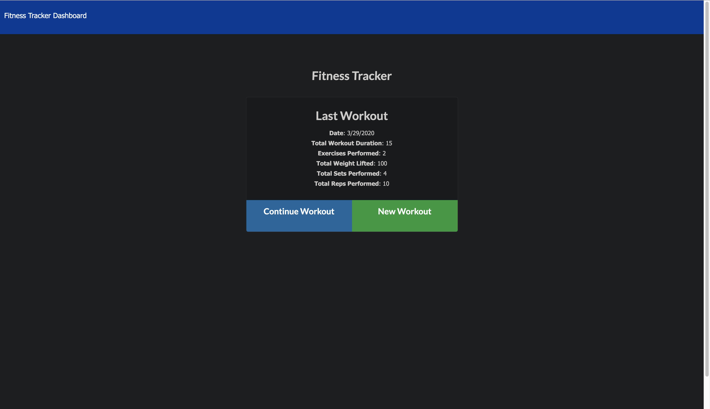
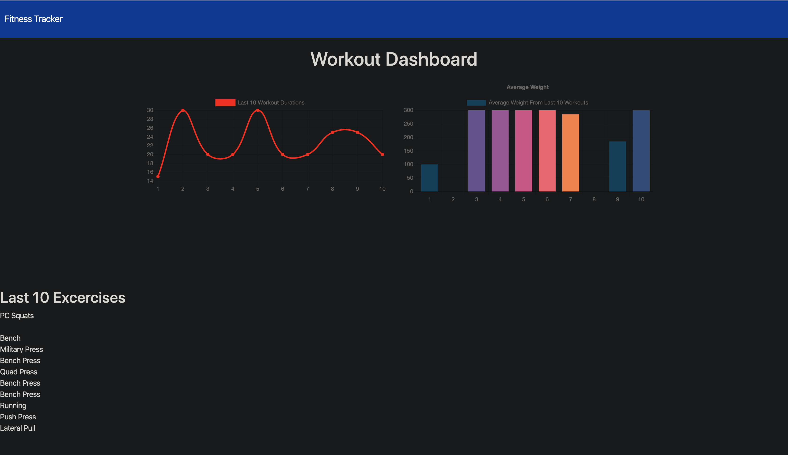
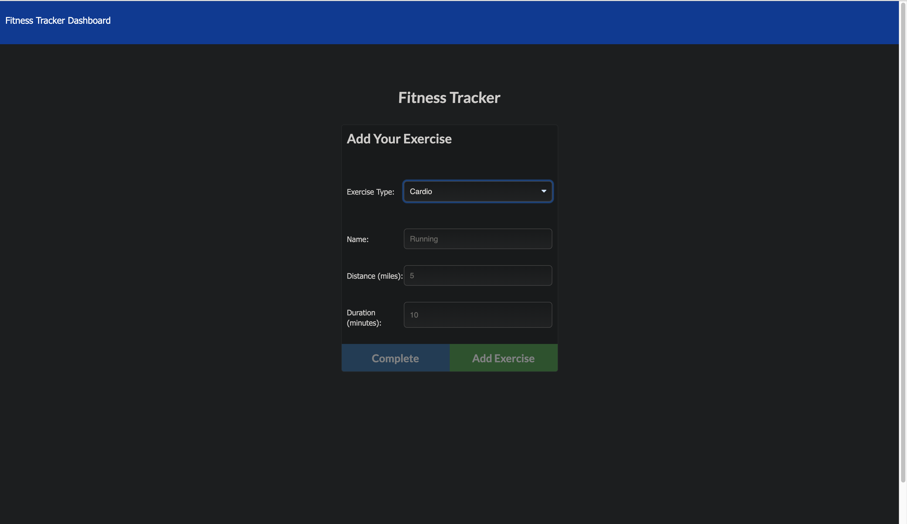
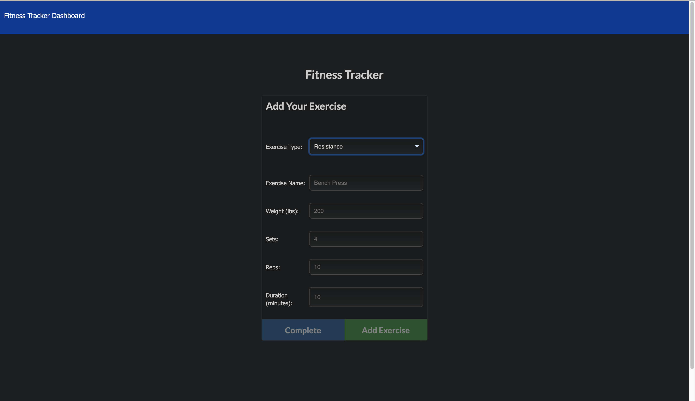

# Workout-Tracker

## Table of contents

- [Deployed Repo](#deployed-repo)
- [Assignment Info](#assignment-info)
- [Technologies](#technologies)
- [Running Pages](#running-pages)
- [Key Notes](#key-notes)

## Deployed Repo

- HTML
  https://all-new-workout-tracker.herokuapp.com/

## Assignment info

This time switching from MySQL to Mongo. Create 
the backend of a workout application. Allowing users 
to both track and add workouts. Bewtween any cardio or
resistance workouts, users will be asked to add information
about the workout. Then after they can see all of their workouts
in a stats page that has a list of the workouts and charts 
showing their progress. All the information is stored in a mongo 
database and collection. 

## Technologies

Project is created with:

- Bootstrap v4.4
- Visual Studios Code (HTML/CSS/JS/JQ)
- Google/W3
- Node.js
- Express
- NPM
- MongoDB
- Mongod

## Running Pages

- Here's screen shots of the running page from an images folder:









## Key Notes

- Bootstrap link for html format

```
<link rel="stylesheet" href="https://maxcdn.bootstrapcdn.com/bootstrap/4.4.1/css/bootstrap.min.css">
```

- Have mongod running in a separate terminal before running app local

- NPM

* install
* express
* seed
* start

- Mongod
- Mongo
